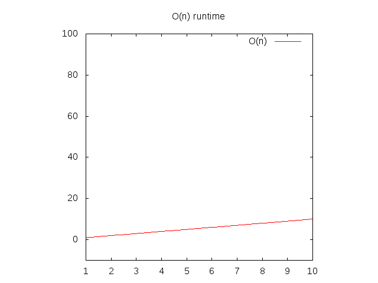
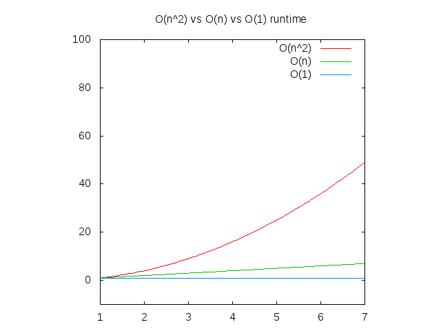

# Algorithms & Big O Notation in Plain English

### What are algorithms? 

Algorithms are basically functions.

With functions that are algorithms
	* you take in arguments.
	* you explicitly return values.

###### 1.1 Example of an algorithm

algorithm that counts the number of vowels in a word and returns the count.

```
function countVowels(word){
	var vowels = ['a', 'i', 'e', 'o', 'u'];
	var count = 0;
	for (var i=0; i<word.length; i++){ count++; }
	return count;
}

```

### When are functions not algorithms?

When you write a function it may or may not
	* have arguments
	* return a value

Functions that don't take arguments or return a value are usually used to dry up repetitive code, print something to the screen or serve as an argument to be executed later

###### 1.2 Example of a function that is not an algorithm

an anonymous function that gets passed to jQuery's on function. 

```
		$('button').on('click', function(){ 
			alert('hi') 
		});
```

###### 1.3 Example of a function that is not an algorithm

This function has no arguments, no return

```
		function clearDiv(){
			$('#div').html("");
		}
```
###### 1.4 Example of a function that is not an algorithm

This function has an argument, but no return

```
		function clearDiv(text){
			$('#div').text(text);
		}
```

### What is Big O?

Big O is short for Big O Notiation.

Big O is how programmers talk about algorithms.

An algorithm's Big O Notation is determined by how long the algorithm takes to return output in the **worst case scenario**.

The math term for the **worst case scenario** is **"upper bound"**.

Example: if I gave an algorithm an array of 1000 items, it would run slower than if I gave the algorithm an array of 10 items.

### How do you say O(n)

O(n) reads as "Order of N" or short for "O of N".

the O function is the Order function.

### Why is it called Big O?

Because we're dealing with orders of magnitude.

### Why is Big O important? 

Orders of magnitude are important.

Imagine you're buying a car and you have two options.

a super car that costs $100k and a sedan that costs $10k.

The cost difference between the super car and the sedan is pretty huge 

BUT in approximation, as long as you're within an order of magnitude, you're pretty close. 

Another example: Let's say there are 50 gumballs in a gumball machine. You guess 500. That's pretty off, but in approximation you're not that off. If you guessed 5000 then you'd be way off.

## Dive into O(1)

###### Example 2.1

```
function returnItem(item){
	return item;
}
```

returnItem is a pointless function. but bear with me.

```returnItem(2);```

returnItem's Big(O) is constant time. No matter what we pass to returnItem, the algorithm will go through one iteration.

The "complexity" of this function is O(1).

If you want to graph O(1) then you would set y equal to 1 and graph it.

**y = 1**


Notice that the further right of the horizontal axis (x axis) you go, the vertical axis (y axis) stays the same.

## Dive into O(n)

###### Example 2.2
```
function itemInList(check, list){
	for (var i=0; i<list.length; i++){
		if (list[i] == check) return true;
	}
	return false;
}
```

This will run pretty quick:

```itemInList(2, [1,2,3]);```

The "complexity" of itemInList is O(n)

This means that it's a linear graph

For itemInList, if the length of the array is 3, **worst case** it'll take 3 iterations.

Sure, in the best case it'll take 1 iteration, but Big O Notation isn't about the best case scenario, it's about the **worst case scenario**.

If you want to graph O(n) then you would replace the n with a x and set it equal to a y.

**y = x**



Notice that the further right of the horizontal axis (x axis) you go, the vertical axis (y axis) goes up too.

## Dive into O(n^2)

###### Example 2.3
```
function allCombos(list){
	var results = [];
	for (var i=0; i<results.length; i++){
		for (var j=0; j<results.length; j++){
			results.push([i, j]);
		}
	}
}
```

If we do allCombos([1,2,3]) we'd get back [(1,1) (1,2), (1,3), (2, 1), (2, 2), (2, 3), (3, 1), (3, 2), (3, 3)].

The "complexity" of allCombos is O(n^2)

The list argument of allCombos is the n in O(n^2)

allCombos([1]) -> [[1,1]]. One iteration.  1^2 = 1
allCombos([1,2]) -> [[1,1], [1,2], [2,1], [2,2]]. Four iterations. 2^2 = 4

So n * n is n^2.

## Comparison of O(1), O(n), O(n^2)

Notice that the further right of the horizontal axis (x axis) you go, the vertical axis (y axis) goes up fastest for O(n^2), slower for O(n) and constant for O(1).

This means that O(n^2) runs slower than O(n), which runs slower than O(1).




## Other Big O Categories from fastest to slowest

O(1): 1 iteration always

O(log(n)) : This is a pretty nice big O category. It grows much slower than O(n). For example, binary search on a sorted list takes O(log(n)) time. Note that the base of the logarithm is not included, since all logarithms differ only by a factor of a constant.

O(n): a loop

O(n(log(n))) : sorting algorithms, such as mergesort and quicksort, fall under this category

O(n^2) : a loop within a loop.

O(a^n) : This is a very slow big O category. Usually, a program in this category has n values that each can be any of a values.

O(n!) : This is one of the worst big O categories. Usually, a program in this category works with all permutations of a list.

## Resources

https://justin.abrah.ms/computer-science/big-o-notation-explained.html

https://brilliant.org/wiki/big-o-notation/


## Other Resources not looked at yet

https://github.com/raywenderlich/swift-algorithm-club/blob/master/Big-O%20Notation.markdown

https://medium.freecodecamp.com/my-first-foray-into-technology-c5b6e83fe8f1#.s488n2g0j

https://medium.freecodecamp.com/time-is-complex-but-priceless-f0abd015063c#.x22db1a69

http://adrianmejia.com/blog/2014/02/13/algorithms-for-dummies-part-1-sorting/

http://stackoverflow.com/questions/487258/what-is-a-plain-english-explanation-of-big-o-notation

http://bigocheatsheet.com/

https://rob-bell.net/2009/06/a-beginners-guide-to-big-o-notation/